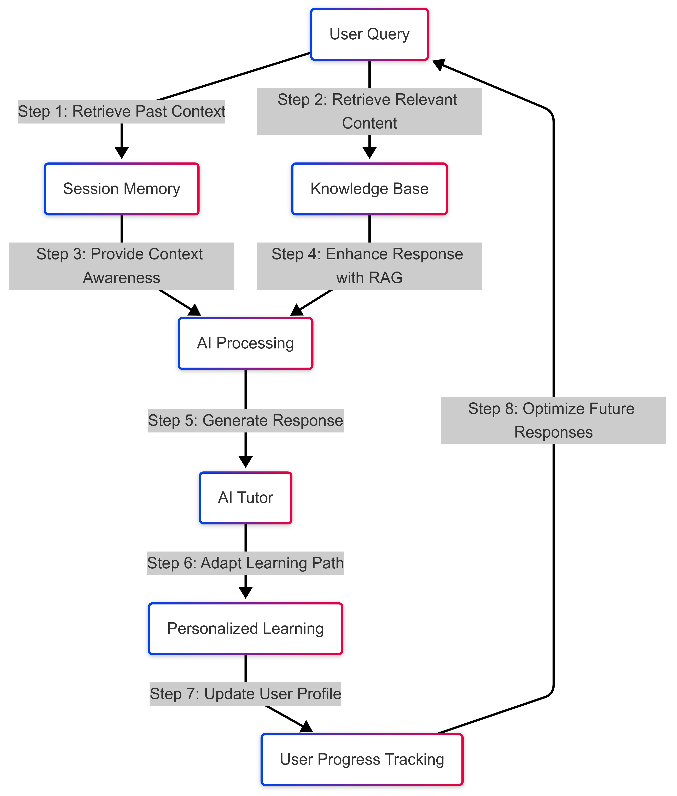

# Auro Tutor - Task 2 Submission

Hey everyone! This is my submission for the second task assigned by Auro as part of the hiring process. The goal here is to analyze the existing Auro Tutor, identify key issues, and propose a comprehensive plan to improve it.

## 🔍 Feature Analysis - Improving Auro Tutor
### Selected Feature: **Auro Tutor** (Reading Section)

Auro Tutor is a key feature in Auro.Edu, designed to assist learners in understanding course material. However, the current implementation has major limitations that hinder its effectiveness. My proposed improvements focus on making the tutor more context-aware and interactive, ensuring a smoother and more intuitive learning experience.

### ⚠️ Current Limitations
The current Auro Tutor has several critical issues that negatively impact the user experience:

#### **Reading Module Limitations for each chapters inside the course content:**
1. **Content awareness** – The Tutor has access or processes reading material, but is ineffective of understanding the material. It answers the first question but does'nt answer the follow up questions accurately when the follow-up question is a different topic from the first question.
provides only basic definitions, lacking depth, personalie and real-world examples.                                                                                                                                                                                                                                                                                                                                             
3. **Copy Restriction** – Users cannot copy text, limiting note-taking and research capabilities.
4. **Lack of Contextual Understanding** – Responses are often generic and rule oreiented fail to provide an personalized answer.

#### **Video Module Limitations:**
4. **Lack of Temporal Context** – The Tutor does not understand questions tied to specific video timestamps (e.g., "Explain what was said at 2:30").
5. **Transcript Ignorance** – The Tutor cannot answer questions based on the video's exact wording or concepts, even when directly mentioned.

#### **Flashcard Module Limitations:**
6. **Superficial Understanding** – The Tutor provides only basic definitions, lacking depth and real-world examples.

#### **Revision Plan for Final Exam Tutor Limitations:**
7. **Pre-Answer Help Limitation** – The Tutor only offers 2 options (i). Revise weak concepts. (ii). Revise questions you got wrong. there is no text box for the user to enter question manually instead of searching the pre tabs.
8. **Post-Answer Explanation Absence** – The Tutor only reveals the correct/incorrect answer without providing explanatory reasoning.
9. **Inaccurate "Weak Concepts" Identification** – The "Revision Plan" incorrectly identifies weak areas, leading to a non-personalized and inefficient review process.

#### **General Limitations Across Modules:**
10. **Limited Conversational Memory** – The Tutor does not remember past interactions, making multi-step queries frustrating.
11. **Keyword Reliance** – Answers are based on keyword matching rather than true comprehension.
12. **No Text Input Box in the Revision Plan for Final Exam Tutor** – Users cannot freely type complex or multi-part questions.
13. **Lack of Personalization** – The Tutor does not tailor responses based on user progress or weak areas.

## 🚀 Proposed Improvements
- **Enable Contextual AI Processing** – Implement LLM + RAG for improved reading comprehension and precise responses.
- **Allow Text Highlighting & Copying** – Give users the ability to copy text for better note-taking and research.
- **Improve Context Awareness in Videos** – Link responses to specific timestamps and integrate transcript-based answers.
- **Expand Flashcard Explanations** – Provide deeper insights and real-world examples beyond basic definitions.
- **Enhance Quiz Assistance** – Offer hints before answering and provide detailed post-answer explanations.
- **Refine Weak Concept Identification** – Improve adaptive learning to personalize revision plans more effectively.
- **Introduce Session-Based Memory** – Maintain conversational context for a smoother and more interactive learning experience.
- **Move from Keyword Matching to True Comprehension** – Use AI to understand intent rather than just scanning for keywords.
- **Add a Free-Form Text Input Box** – Allow users to ask complex, multi-part questions freely.
- **Personalized Learning Paths** – Adapt responses based on user history, progress, and weak areas.

  ## RAG (Retrieval-Augmented Generation) and Context Awareness work with Session-Based Memory and Personalized Learning Paths in Auro Tutor.
  
  

## 🖌️ Low-Fidelity Wireframe
To visualize the improved Auro Tutor, I’ve created a wireframe in Figma showcasing the new features and user flow.

[Figma Link: Auro Tutor - Reading Section](https://www.figma.com/design/24Y4120l48MWeBJSZ0RL4D/Gagan-N's-team-library-(Copy)?node-id=3312-2&t=i0YezYxLB8tSoMhy-1)

---

## 🔄 User Journey - Improved Tutor in Action
1. **User enters the reading module** – They begin engaging with the course content.
2. **Seeking Help (Highlighting Text)**
   - User copies a confusing sentence.
   - A floating "Auro Tutor" icon appears at the right bottom corner of the screen.
   - User pastes the confusing sentence and clicks the icon to get an instant explanation.
   - Tutor provides an AI-generated, context-aware response.
3. **Copy Functionality**
   - User can copy highlighted text for note-taking.
4. **Conversational Follow-Up**
   - User asks follow-up questions in a chat-like interface.
   - Tutor maintains conversation context for coherent responses.
5. **User Continues Learning**
   - The Tutor remains available for assistance, ensuring a seamless study session.

---

## 🌟 Why This Matters
- ✅ **Fixes Key Learning Barriers** – Enables deeper understanding through context-aware AI.
- ✅ **Enhances Retention** – Personalized, interactive explanations keep learners engaged.
- ✅ **Improves Usability** – Intuitive highlighting, copy options, and conversational AI streamline learning.

---

# 🛠️ Product Analysis

## Executive Summary

Designed to enhance user experience, boost engagement and retention, and drive revenue growth. Recommendations are grounded in user-testing analysis and a review of the existing website. The proposal addresses key deficiencies in navigation, course structure clarity, Auro Coins utilization, transparency, feature gaps, AI Tutor quality, and introduces new revenue-generating opportunities centered around competitive learning and refined premium offerings.

## Current State Analysis (Identified Problems)

Testing and a visual inspection of the website revealed the following areas for improvement:

### 1. Navigation and Course Structure:
- **Confusing Navigation:** The top navigation bar (Home, My Learning, Exchange, Career), while consistent, can be disorienting when transitioning between sections. The profile dropdown adds complexity.
- **Lack of Clear In-Course Progress:** The "Course Content" section lists chapters but lacks visual progress tracking *within* the learning experience itself.
- **Missing "Back to Course" Button:** No readily apparent "back" navigation is available within individual chapters.
- **Inconsistent Visual Hierarchy:** The "Explore Courses" dropdown and search bar compete for attention. "Digital" and "Investment" buttons on the "Exchange" page are not well-integrated. The Leaderboard page is a side tab and easily overlooked.

### 2. Auro Coins Utility and Transparency:
- **Limited Visibility:** The Auro Coin balance is only visible in the user profile dropdown, lacking prominent display and explanation.

### 3. Misleading Information, Feature Enhancement, and AI Tutor Quality:
- **"Live Classes" Misrepresentation:** The website advertises "Interactive Live Classes," but offers pre-recorded videos.
- **Static Ratings:** Course pages show static ratings with no indication of recency or update mechanism.
- **No Dark Theme:** A dark theme option is absent.
- **Auro Tutor Audio Issues:** The AI Tutor's speech is slow, and the voice tone is perceived as irritating.

### 4. Course Filtering:
- **Filtering by Levels:** Level selection in course filtering doesn't highlight the currently selected option.

## Proposed Improvements and Solutions

### 1. Navigation and Course Structure Clarity
- **Streamlined Top Navigation:**
  - Maintain: Home, My Learning, Exchange, Career.
  - Move "Auro Coins" to the main navigation bar (icon + balance).
  - Integrate "Settings" and profile options into "My Learning" or a dedicated "Account" section.
- **In-Course Progress Bar:** Display a prominent, segmented progress bar at the top of each course page *and each module page*.
- **"Back to Course" Button:** Include a clear "Back to Course Content" button within each chapter.
- **Improved Visual Hierarchy:**
  - Make the "Explore Courses" dropdown more prominent.
  - Ensure the search bar is clearly visible.
  - Integrate "Digital" and "Investment" as *filters* within a unified "Exchange" page.

### 2. Auro Coins Utility and Transparency
- **Auro Coins Information Page:** Create a dedicated page explaining how to earn, redeem, and understand the value of Auro Coins. Link this page from the Auro Coins balance display and "My Learning."
- **Contextual Messaging:** Integrate clear messaging about Auro Coins throughout the platform (course pages, Exchange, onboarding).

### 3. Addressing Misleading Information, Enhancing Features, and Improving AI Tutor Audio
- **"Live Classes" Clarification:**
  - **Short-Term:** Rename to accurately reflect the current offering (e.g., "Expert Video Courses with Q&A Support").
  - **Long-Term:** Plan and implement *genuine* live classes.
- **Real-Time Feedback and Ratings:** Collect user feedback immediately after course/module completion to generate dynamic ratings.
- **Dark Theme:** Add a dark theme option.
- **Auro Tutor Audio Improvement:**
  - Implement user-adjustable speech speed control.
  - Offer a selection of AI voices.
  - **Long-Term:** Invest in a higher-quality TTS engine.
  - **Improve AI Tutor:** Implementing Generative AI, specifically leveraging a Large Language Model (LLM) fine-tuned on the course content, combined with Retrieval-Augmented Generation (RAG).

### 4. Revenue Generation Opportunities

#### A. Competitive Learning Platform:
- **Concept:** Introduce a platform for challenges and tournaments related to course material.
- **Entry Fees:** Charge Auro Coins or fiat currency for participation.
- **Prizes:** Award cash, Auro Coins, premium access, merchandise, or partner offers.
- **Competition Types:** Quizzes, coding challenges, investment simulations, project-based competitions.
- **Leaderboards:** Public leaderboards to foster competition.

#### B. Enhanced Premium Subscription Tiers:
- **Concept:** Expand/introduce a tiered subscription model with clearly defined benefits.
- **Tiers (Example):** Free, Basic, Pro, Elite – with increasing access to courses, Tutor features, live classes, competitions, and coaching.

#### C. À la Carte Purchases:
- **Concept:** Allow purchase of individual premium items: courses, workshops, coaching, competition entries.

#### D. Pay-Per-Module/Quiz (Refined):
- Allow limited *free* quiz retakes.
- Offer targeted review material before requiring payment.
- Provide an "Unlock Module" option for a fee after multiple failures, positioned as supporting continued learning.
- **Premium Feature:** Provide hints, Auro Tutor explanations before taking the quiz, for premium members.

## Conclusion

This proposal provides a concrete roadmap for Auro.edu to enhance user experience, drive engagement, and unlock revenue potential. Addressing navigation, clarity, feature gaps, and the AI Tutor, alongside introducing competitive learning and refined premium options, creates a more valuable and successful learning platform. This elevates Auro.edu from a basic course provider to a dynamic, engaging, and rewarding destination for financial education.

That’s it for my second task! Let me know if you have any feedback. Looking forward to the next step. 😊

